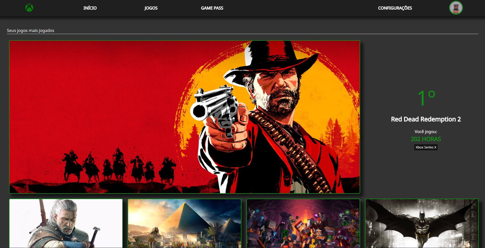
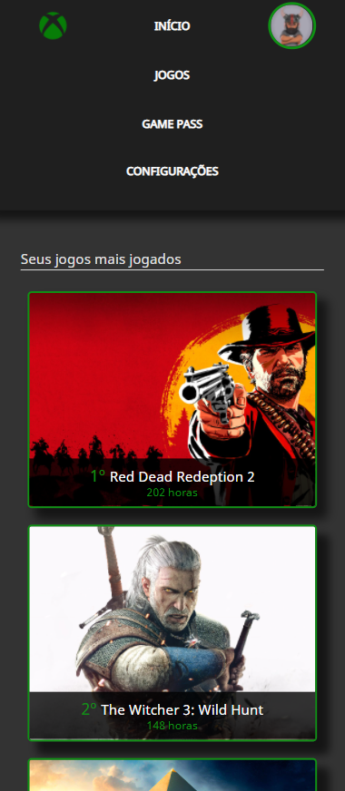

<h1 align="center">Xbox Mais Jogados</h1>

    

 Site do Xbox que mostra os jogos mais jogados pelo usuário. Acesse o projeto clicando <a href="https://brunosabbagmachado.github.io/xbox-mais-jogados/">aqui</a>.

    

    

# Tabela de conteúdos

<!--ts-->
- [Sobre](#Sobre)
- [Projeto](#O-Projeto)
- [Imagens](#Imagens)
- [Conclusão](#Conclusão)
- [Sobre mim](#Sobre-mim)
<!--te-->

# Sobre

Criei uma página para mostrar os jogos que mais joguei no console Xbox.

A ideia desse projeto surgiu após ver a campanha que a [Playstation](https://blog.br.playstation.com/2022/01/20/reflita-sobre-suas-conquistas-nos-games-do-ano-passado-com-a-retrospectiva-playstation-de-2021/) fez no final de 2021, mostrando em retrospectiva os jogos mais jogados por cada usuário e também o tempo de jogo e a quantidade de novos troféus. 

Como sou jogador de [Xbox](https://www.xbox.com/pt-BR/), resolvi fazer uma página semelhante, com o design do Xbox e acrescetando algumas informações que me pareceram interessantes para o projeto.

Todo o site foi constrúido com CCS Grid para as classes principais e um pouco de CSS Flexbox para as subclasses. Para isso usei de base o [curso da Alura](https://cursos.alura.com.br/course/css-grid-layout) sobre Grid e também fiz várias pesquisas sobre as ferramentas para entender e saber usar minhas opções.

# O Projeto

Esse site possuí apenas uma página, com links não redirecionaveis, pois meu foco era entender e descobrir mais sobre as ferramentas do CSS Grid.

Os jogos mostrados nesse site são jogos que eu gosto de jogar, porém a quantidade de horas jogadas não reflete a realidade, uma vez que no aplicativo da Xbox alguns jogos que joguei não mostram a quantidade de horas jogadas.

Todo site foi criado usando HTML 5 e CSS 3, sendo as principais ferramentas usadas o CSS Grid e Flexbox.

# Imagens

<h2 align="center">Computador</h2>

    

 

<h2 align="center">Celular</h2>

    

# Conclusão

O projeto é simples mas creio que atingi meu objetivo de aprender a usar o CSS Grid e suas propriedades. Consegui criar um site com uma reprodução fiel do design do Xbox e além disso o site tem 3 níveis de responsividade. 

O projeto foi concluído em 10 dias.

# Sobre mim

Oi, eu sou o Bruno e é uma honra ter você aqui.

Espero que tenha gostado do projeto. Fique a vontade para comentar, ou até melhorar o código. Será um prazer compartilhar conhecimentos.

Me siga aqui no [Github](https://github.com/brunosabbagmachado) e também no [Linkedin](https://www.linkedin.com/in/brunosabbagmachado/). Vou te seguir de volta e será uma horna ter você na minha rede.

Abraços

